# Домашнее задание: Продвинутые методы работы с Terraform - Шаров Олег

---

# 🏠 Домашнее задание 4

## 🎯 Задание 1: Работа с remote-модулями

### Что сделано:
- ✅ Созданы 2 ВМ через remote-модуль `yandex_compute_instance` (marketing и analytics)
- ✅ Использованы labels для обозначения проектов (`project = "marketing"`, `project = "analytics"`)
- ✅ SSH-ключ передаётся через переменную `vms_ssh_root_key` (не хардкод)
- ✅ В cloud-init.yml добавлена установка nginx
- ✅ ВМ прерываемые (`preemptible = true`) для экономии средств
- ✅ Пользователь для подключения: `ubuntu`

### Файлы:
- `main.tf` — конфигурация с вызовами remote-модулей
- `cloud-init.yml` — шаблон настройки ВМ (пользователь ubuntu, nginx)
- `marketing_vm_output.txt` — вывод terraform console для module.marketing_vm

### Скриншоты:
- 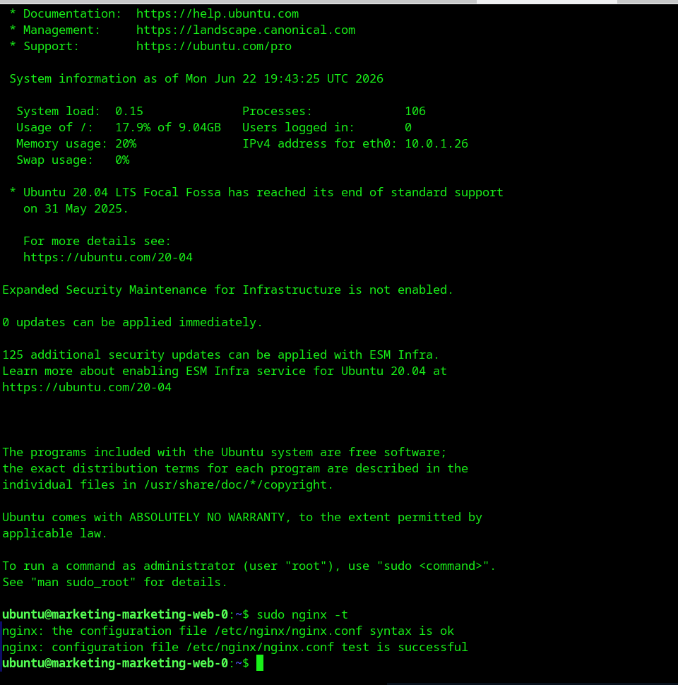 — подключение по SSH и проверка nginx
- 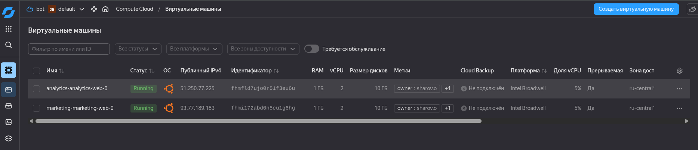 — консоль Yandex Cloud с метками ВМ

---

## 🎯 Задание 2: Создание локального модуля VPC

### Что сделано:
- ✅ Создан локальный модуль `vpc` с сетью и подсетью
- ✅ Модуль принимает переменные: `env_name`, `zone`, `cidr`
- ✅ Модуль возвращает outputs: `network_id`, `subnet_id`
- ✅ Корневой модуль использует `module.vpc_dev`
- ✅ Сгенерирована документация через `terraform-docs`

### Структура модуля:
```
vpc/
├── main.tf         # Ресурсы сети и подсети
├── variables.tf    # Переменные модуля
├── outputs.tf      # Выходные значения (network_id, subnet_id)
└── README.md       # Автогенерированная документация
```

### Скриншоты:
- 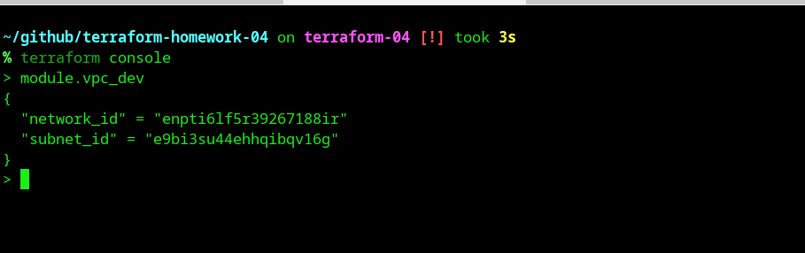 — вывод terraform console для module.vpc_dev

---

## 🎯 Задание 3: Работа со state (импорт/экспорт)

### Что сделано:
- ✅ Удалены модули из state через `terraform state rm`
- ✅ Получены ID ресурсов из Yandex Cloud
- ✅ Импортированы ресурсы обратно через `terraform import`
- ✅ Проверен `terraform plan` — значимых изменений нет

### Процесс:
1. Удаление из state: `terraform state rm module.vpc_dev`, `module.marketing_vm`, `module.analytics_vm`
2. Получение ID: `yc vpc network list`, `yc vpc subnet list`, `yc compute instance list`
3. Импорт: `terraform import module.vpc_dev.yandex_vpc_network.network <ID>`
4. Проверка: `terraform plan` → `Plan: 0 to add, 2 to change, 0 to destroy`

### Скриншоты:
- 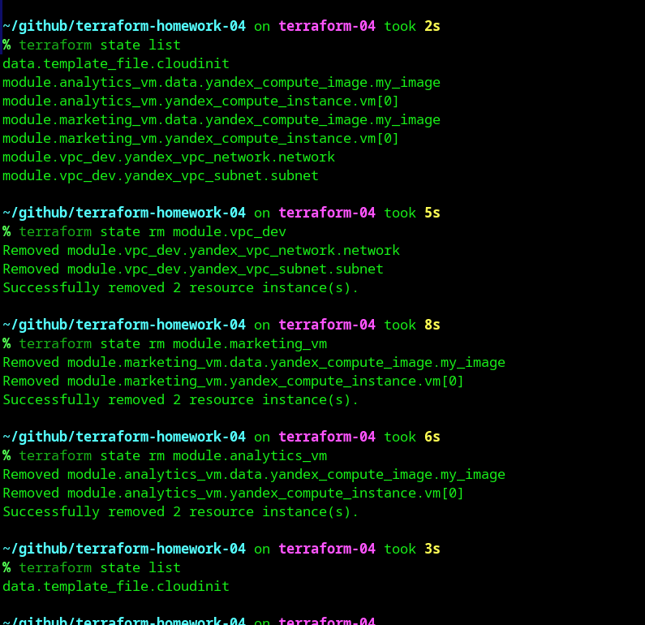 — процесс удаления модулей из state
- 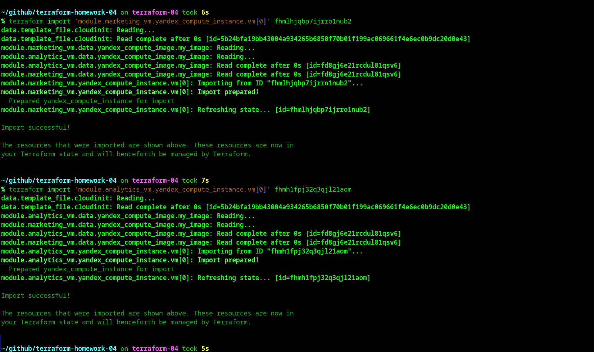 — импорт ВМ
- 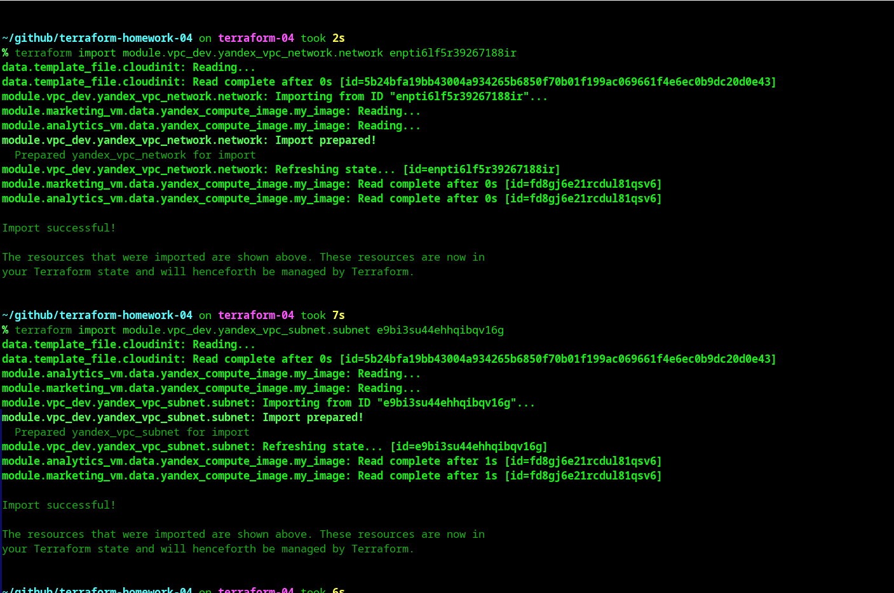 — импорт сети и подсети
- 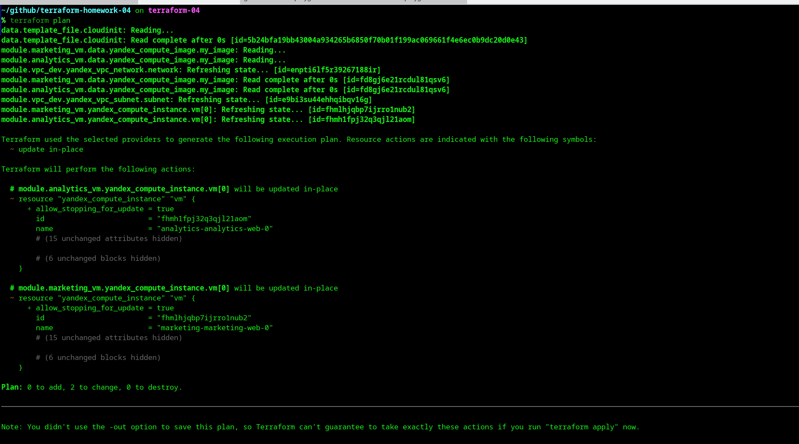 — финальная проверка plan

---

## 🚀 Как запустить

1. Клонировать репозиторий:
```bash
git clone <URL_репозитория>
cd terraform-homework-04
```

2. Создать файл `personal.auto.tfvars`:
```hcl
token     = "your_oauth_token"
cloud_id  = "your_cloud_id"
folder_id = "your_folder_id"
vms_ssh_root_key = "your_ssh_public_key"
```

3. Инициализировать и применить:
```bash
terraform init
terraform apply
```

4. Подключиться к ВМ:
```bash
ssh ubuntu@<public_ip>
sudo nginx -t
```

---

## 🧹 Удаление ресурсов

```bash
terraform destroy
```

---

## 📚 Документация модулей

- [Документация модуля VPC](./vpc/README.md)

---

# 🏠 Домашнее задание 5: Использование Terraform в команде

## 🎯 Задание 1: Проверка кода линтерами

### Инструменты проверки:
- ✅ **tflint** — статический анализ Terraform кода
- ✅ **checkov** — проверка на соответствие best practices и безопасность

### Проверенные папки:
1. Основной код (ДЗ к лекции 4)
2. Демо-код из лекции 4 (папки `passwords` и `vms`)

---

### Найденные ошибки tflint (3 типа):

1. **`terraform_module_pinned_source`** — модули используют нефиксированные версии (ссылка на ветку `main`)
   - Файлы: `main.tf` (основной код и `vms`)
   - Решение: использовать commit hash или tag вместо ветки

2. **`terraform_required_providers`** — отсутствуют ограничения версий для провайдеров
   - Провайдеры: `yandex`, `template` (основной код и `vms`), `random` (папка `passwords`)
   - Файлы: `providers.tf`, `main.tf`
   - Решение: добавить `version = "~> x.x"` в блок `required_providers`

3. **`terraform_unused_declarations`** — объявлены неиспользуемые переменные
   - Переменные: `vm_web_name`, `vm_db_name` (основной код), `public_key` (папка `vms`)
   - Файлы: `variables.tf`
   - Решение: удалить неиспользуемые переменные или использовать их

---

### Найденные ошибки checkov (2 типа):

1. **`CKV_TF_1`** — "Ensure Terraform module sources use a commit hash"
   - Ресурсы: `marketing_vm`, `analytics_vm` (основной код), `test-vm`, `example-vm` (папка `vms`)
   - Файлы: `main.tf`
   - Решение: использовать commit hash в `source` модуля

2. **`CKV_TF_2`** — "Ensure Terraform module sources use a tag with a version number"
   - Ресурсы: `marketing_vm`, `analytics_vm` (основной код), `test-vm`, `example-vm` (папка `vms`)
   - Файлы: `main.tf`
   - Решение: использовать tag с версией (например, `?ref=v1.0.0`)

---

### Команды для проверки:
```bash
# Проверка tflint
tflint
cd passwords && tflint && cd ..
cd vms && tflint && cd ..

# Проверка checkov
checkov -f main.tf providers.tf variables.tf outputs.tf
checkov -d /home/oleg/github/terraform-homework-04/passwords --framework terraform
checkov -d /home/oleg/github/terraform-homework-04/vms --framework terraform
```

---

## 🎯 Задание 2: Настройка Remote State и блокировок

### Что сделано:
- ✅ Создан S3 bucket `oleg-sharov-tfstate-2026` в Yandex Cloud для хранения state.
- ✅ Создан отдельный сервисный аккаунт `terraform-state-sa` (соблюдаем принцип наименьших привилегий).
- ✅ Выдана роль `storage.editor` сервисному аккаунту на уровне каталога (folder).
- ✅ Сгенерированы статические ключи доступа (access_key / secret_key).
- ✅ Настроен S3 backend в `providers.tf` (ключи хранятся в `~/.aws/credentials`, хардкод секретов исключен).
- ✅ Успешно выполнена миграция локального `terraform.tfstate` в удаленный backend (`terraform init -migrate-state`).
- ✅ Протестирован механизм блокировок (state lock) при одновременном запуске команд.

### Изменения в коде:
- `providers.tf` — добавлен блок `backend "s3"` с настройками Yandex Object Storage и флагами `skip_*` для корректной работы с YC.

### Скриншоты:
- 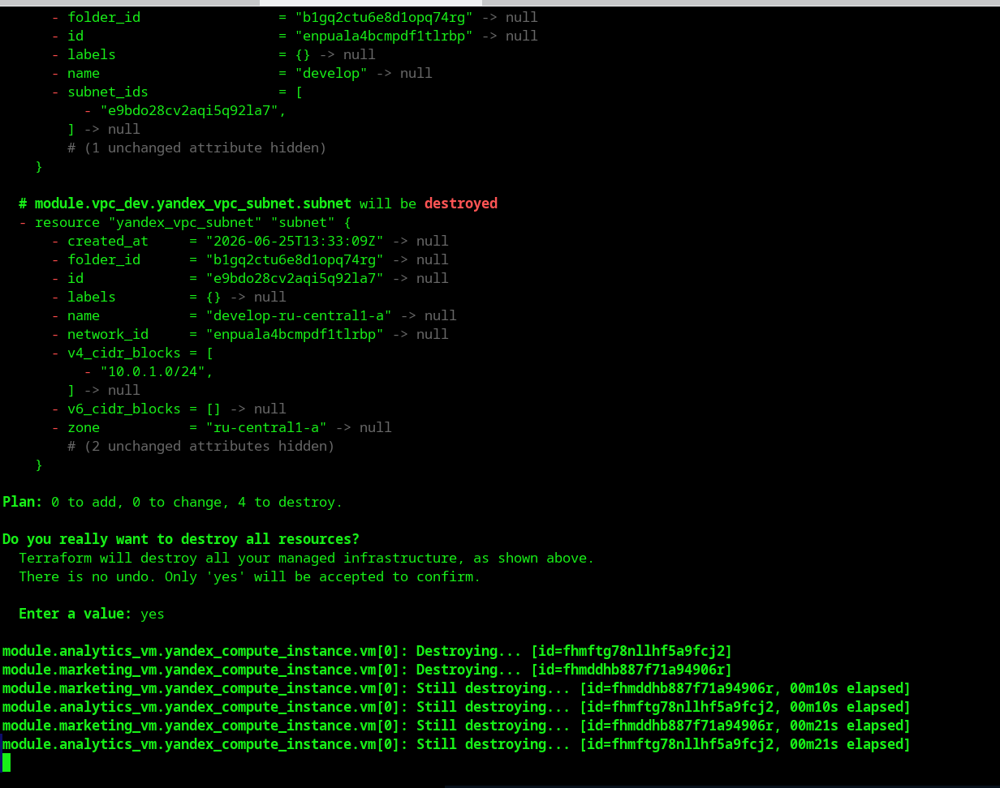 — процесс работы в первом терминале (удержание блокировки)
- 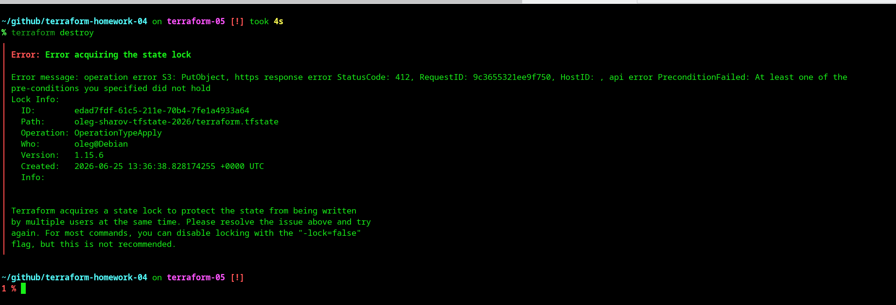 — ошибка блокировки во втором терминале (`Error acquiring the state lock`)

### Тестирование блокировок с terraform console:

1. В первом терминале запущен `terraform apply` (ожидает подтверждения):
   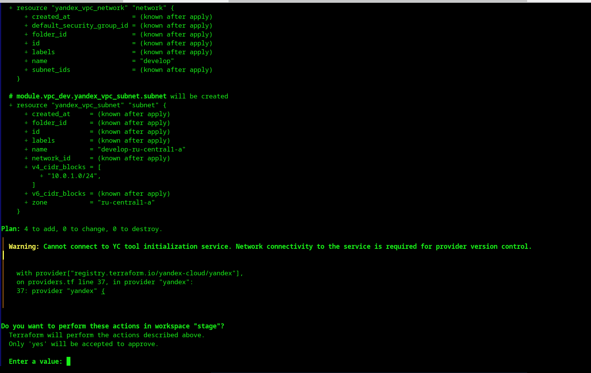

2. Во втором терминале при попытке `terraform plan` получена ошибка блокировки:
   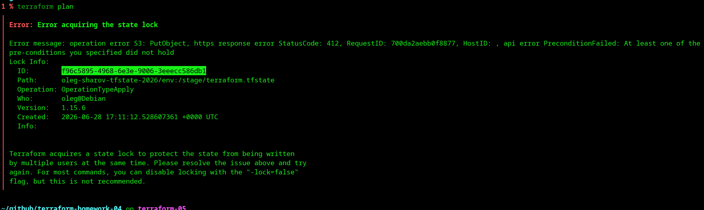

3. Принудительная разблокировка state:
   ```bash
   terraform force-unlock f96c5895-4968-6e3e-9006-3eeecc586db1
   ```
   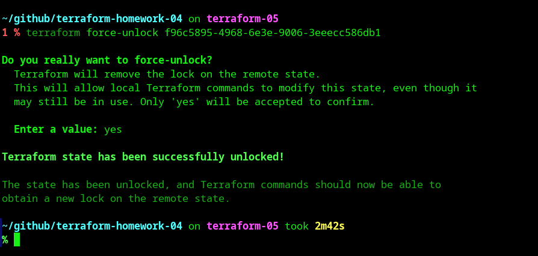

---

## 🎯 Задание 3: Работа с Workspaces (Рабочими пространствами)

### Что сделано:
- ✅ Созданы workspaces: `stage` и `prod` (помимо стандартного `default`)
- ✅ Модифицирован код в `main.tf`: добавлено использование `terraform.workspace` в имени ВМ
- ✅ Протестирована изоляция state между workspaces
- ✅ Подтверждено, что ресурсы в разных workspace имеют разные имена и не конфликтуют

### Изменения в коде:
- `main.tf` — изменен параметр `instance_name` в модуле `marketing_vm`:
  ```hcl
  instance_name = "marketing-web-${terraform.workspace}"
  ```

### Скриншоты:
- 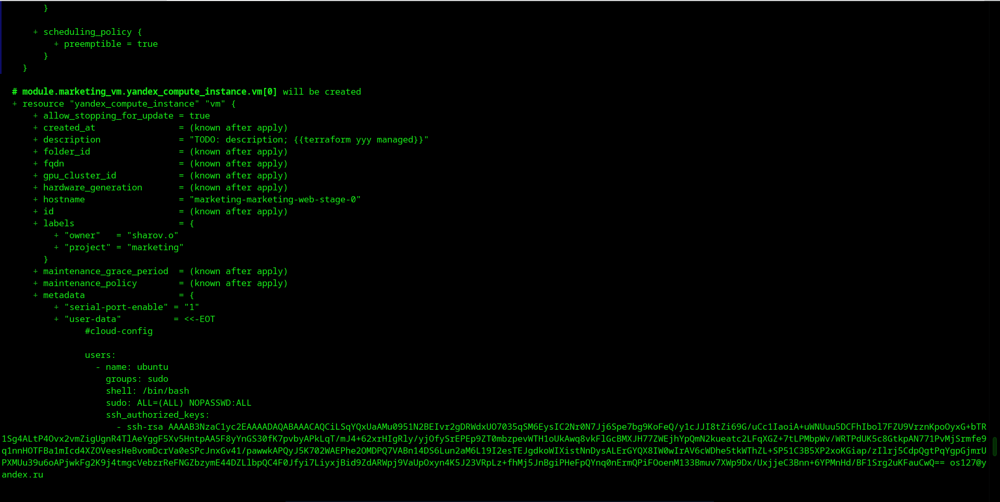 — вывод `terraform plan` в workspace `stage` (имя ВМ: `marketing-web-stage`)
- 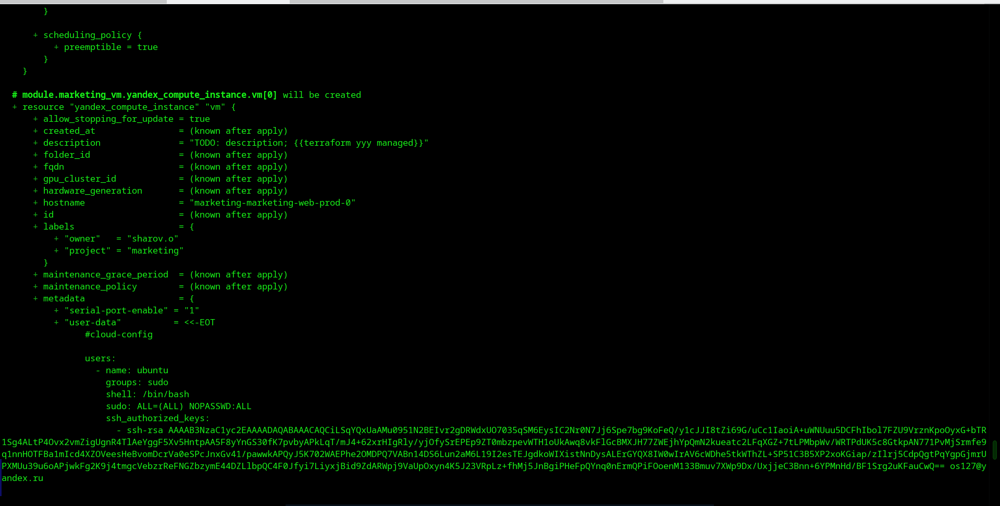 — вывод `terraform plan` в workspace `prod` (имя ВМ: `marketing-web-prod`)

---

## 🎯 Задание 4: Исправление предупреждений линтеров и Pull Request

### Что сделано:
- ✅ Создана ветка `terraform-hotfix` из `terraform-05`
- ✅ Исправлены все предупреждения tflint и checkov
- ✅ Заменены ссылки на модули с `ref=main` на commit hash `4d05fab828b1fcae16556a4d167134efca2fccf2`
- ✅ Удалены неиспользуемые переменные `vm_web_name` и `vm_db_name`
- ✅ Создан Pull Request: https://github.com/Myth3916/terraform-homework-04/pull/1

### Результаты проверок:

**tflint:**
```
0 issue(s) found
```

**checkov:**
```
Passed checks: 8, Failed checks: 0
```

### Цель задания:
Научиться работать с Pull Requests для code review в команде. Исправления были внесены в отдельную ветку и оформлены как PR для проверки, без слияния в основную ветку.

---

## 🎯 Задание 5: Валидация переменных

### Что сделано:
- ✅ Создан файл `validation.tf` с переменными и валидацией
- ✅ Переменная `ip_address` (string) — проверка корректности IPv4 адреса
- ✅ Переменная `ip_list` (list(string)) — проверка всех IP в списке
- ✅ Протестированы сценарии с верными и неверными значениями

### Тесты:
1. **Успешная валидация** (значения по умолчанию):
   ```bash
   terraform plan
   ```
   Результат: ✅ Plan успешно выполнен

2. **Неверный IP-адрес** (`1920.1680.0.1`):
   ```bash
   terraform plan -var="ip_address=1920.1680.0.1"
   ```
   Результат: ❌ Ошибка: "Неверный формат IP-адреса"

3. **Неверный IP в списке** (`1270.0.0.1`):
   ```bash
   terraform plan -var='ip_list=["192.168.0.1", "1.1.1.1", "1270.0.0.1"]'
   ```
   Результат: ❌ Ошибка: "Один или несколько IP-адресов имеют неверный формат"


### Скриншоты:
- 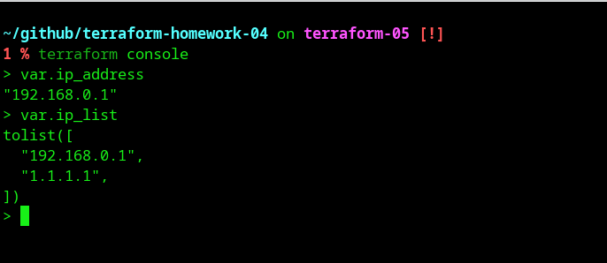 — `terraform console`: проверка переменных `var.ip_address` и `var.ip_list`
- 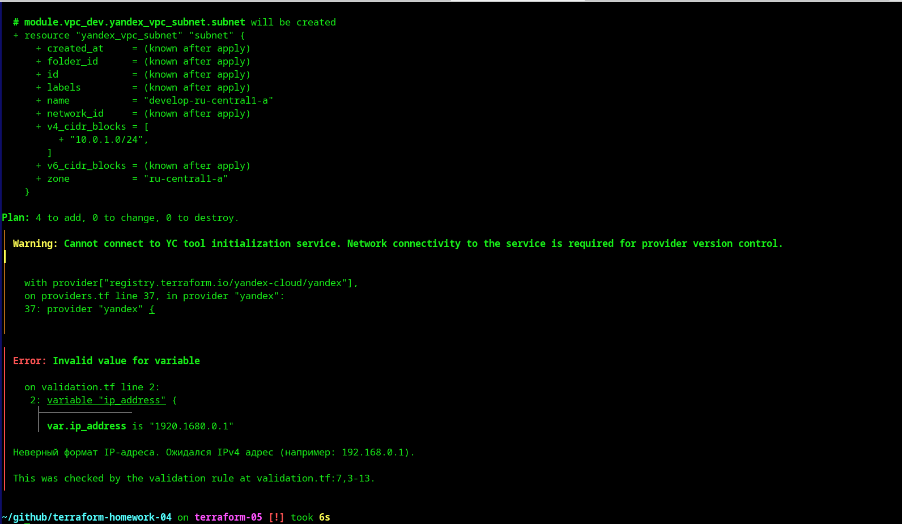 — ошибка валидации для `ip_address=1920.1680.0.1`
- 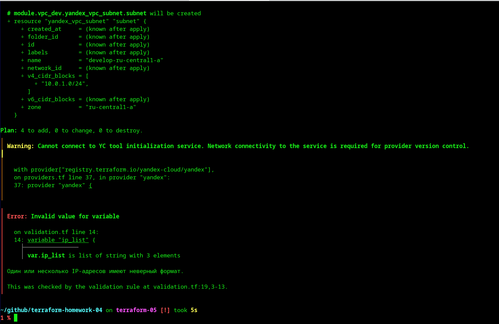 — ошибка валидации для списка с `1270.0.0.1`

---